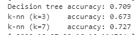
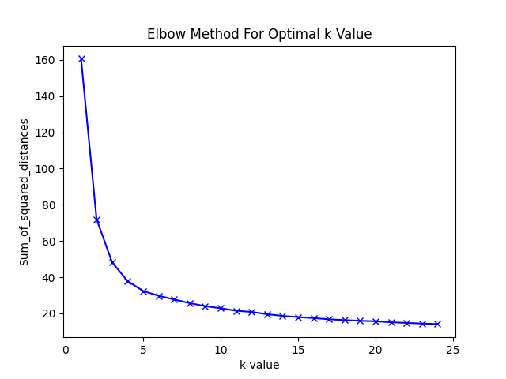
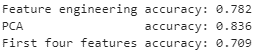

# Predicting-Average-Life-Expectancy-With-Sklearn
## Summary
The main objective of this project was to create 3 different models which would predict a country's average life expectancy based off of the country's other attributes and statistics. Three different models were used. A decision tree, a k-nn model with a k value of 3, and a k-nn model with a value of 7. First, all features are considered, then feature engineering is used to pick the top 4 features for the model.

# Using all features
## Pre-processing
In order to analyse the data provided, the two csv files, world.csv and life.csv, are parsed into a dataframe. These two dataframes are then merged together on the ‘Country Code’ column, removing any rows that do not have a matching country code in the other dataframe. Upon inspection, many rows contain the text, “..”, which signifies an absence of data. These values are then replaced with numpy’s nan data type, so that these cells can be imputed later. The “Life expectancy at birth (years)” column will be used as the label that will be used to train the models, and the last 20 columns (Starting with “Access to electricity (% of population) [EG.ELC.ACCS.ZS]”) in the dataframe will be used as the features.

## Imputation of Features
Since the models that we are using to predict data cannot handle incomplete data, we need to handle these values ourselves. The simplest method to deal with this is to discard all rows which have a single cell of incomplete data. However, this comes at the cost of losing data which could massively impact the accuracy of the model (especially in this case, as the sample data size is already small). Instead, we opt to predict what the incomplete values should be based on the other complete rows in the data set. In this case, we use the median of the data set to estimate what the missing values are likely to be. The median value for each column is then stored to be accessed for the output csv file later on.

## Normalisation of Features
The data stored in the columns can have very large numbers, this can cause computational problems when calculating the distance between two points of data in the future, as larger numbers will take longer to compute. If we were to make the numbers smaller, we would still be able to predict new data point with the same level of accuracy as the prediction will be in proportion to the other values, as well as saving the amount of time it takes to compute the distance between two points. Therefore, the training and test values are then normalised to have a mean and unit variance of 0. We are also able to get the mean and variance of each column in this step, so we are able to save it for the output csv file later on.  

## Outcome of Results

  

Now that the data is pre-processed, the models can be trained. As a result, the accuracy of the decision tree was 0.709, the accuracy of the k-nn model with a k value of 3 was 0.673, and the accuracy of the k-nn model with a k value of 7 was 0.727. Thus, you can conclude the k-nn algorithm with a k value of 7 outperforms the decision tree, however the decision tree outperforms the k-nn algorithm was a k value of 3. Therefore, it appears that k-nn algorithms outperform decision trees for a sufficient value of k, however, decision trees are much faster computationally than k-nn algorithms.

The results claim that increasing the number of neighbours that you check when using the k-nn algorithm will increase the accuracy of your predictions. This could be because when you check a small amount of neighbours for each data point, one outlier will make a much more significant impact on the predicted value than if you had a large amount of neighbours. Since we are using a small dataset, it is very likely that there would be some noticeable outliers which would have this issue. We could potentially solve this problem by increasing the size of the dataset, however, since there are a small number of countries in the world, you cannot increase the sample size by much. You could make sure “life.csv” has a row for every country, or you can include rows from other years to increase the sample size.

# Using feature engineering
## Pre-processing
To start off, the algorithm uses the same pre-processing as defined in the previous task, therefore all of the training and test data up to this point is equivalent to the data that trained the decision tree and k-nn models. All of the data is already imputed and normalised as well.

## Feature Engineering using Interaction Term Pairs
To generate all unique pairs of features, a nested for loop is used.  
The new column is created by multiplying the two columns together, generating 190 new columns, which brings the total number of features up to 210. 

## Clustering Labels
Next, it will generate the clustering label to be used as a feature alongside with the interaction term pairs. In order to determine the number of clusters used, I used the elbow method. The elbow method essentially takes a graph which plots the number of clusters vs the sum of squared distances, as shown to the left. The optimal k value for this graph occurs when the slope between two points starts to fall off, which in this case, is when k is 5. Thus, the number of clusters chosen is 5.

## Choosing the Best 4 Features

  

Now that we have a total of 211 features, we want to find the best 4 features that will provide the most accurate predictions. I decided to use sklearn’s mutual information algorithm to give each feature a mutual information value, and then selected the 4 features with the highest values. This is because mutual information measures the correlation between two sets of data. If a feature has a high value for mutual information, it means that the feature is highly correlated with the set of data. Therefore, by selecting the top 4 highest values, it is likely to give us the highest accuracy possible with only 4 of the features.

## Feature Engineering and Selection via PCA
This step is very simple. It takes the training and test data from the task 2a and uses sklearn’s PCA algorithm with n_components set to 4. The PCA algorithm aims to reduce the size of a set of data, while still maintaining as much information about the original dataset as possible. It does this by generating a set of new, uncorrelated values, which causes the new dataset to have a much higher variance.

## Outcome of Results

  

Now that 3 different sets of data have been created, we can use the data to train 3 separate k-nn models with a k value of 3, and measure the accuracy. Overall, using a random_state of 139, it was found that the PCA method resulted in the highest accuracy (0.836), and using the first four features resulted in the lowest accuracy (0.709). It is no surprise that the first four features scored the lowest as there was no reason why these four features were selected other than because they were the first four. 

It is interesting that PCA scored much higher than the feature engineering, as PCA tends to trade a smaller set of data for a lower amount of accuracy. The feature engineering method attempted to create a bunch of extra features, and take the top 4 most correlated features, however it didn’t perform nearly as well. The accuracy values for both of them are good enough to make an assumption, however is not accurate enough to be certain of a prediction.

These accuracy values are highly dependent on the random state that was used in the algorithm, so it is not reliable enough to say that one method is better than the other in all cases. Since the sample size for the data is very small, the way in which you divide the training and test values can make a significant impact on the accuracy of the algorithm.

As mentioned previously, some improvements that could be made to improve the accuracy of the algorithms would be to increase the sample size of the data, by making sure that every country has an entry in life.csv. Additionally, an algorithm that can detect and eliminate outliers could be created which can reliably remove these outliers from the dataset. Since the data set is small, these outliers will make a more significant impact on the accuracy of the training data, so being able to remove these should make a noticeable difference on the accuracy of the algorithms.
